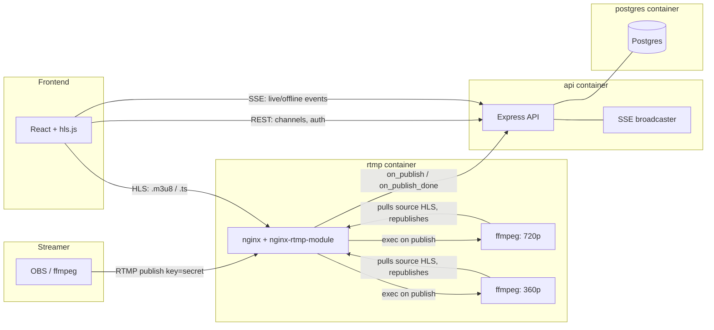
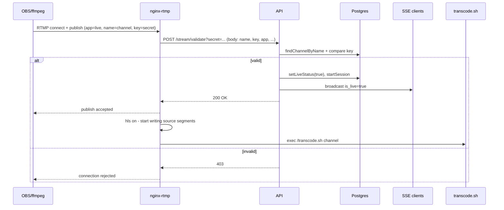
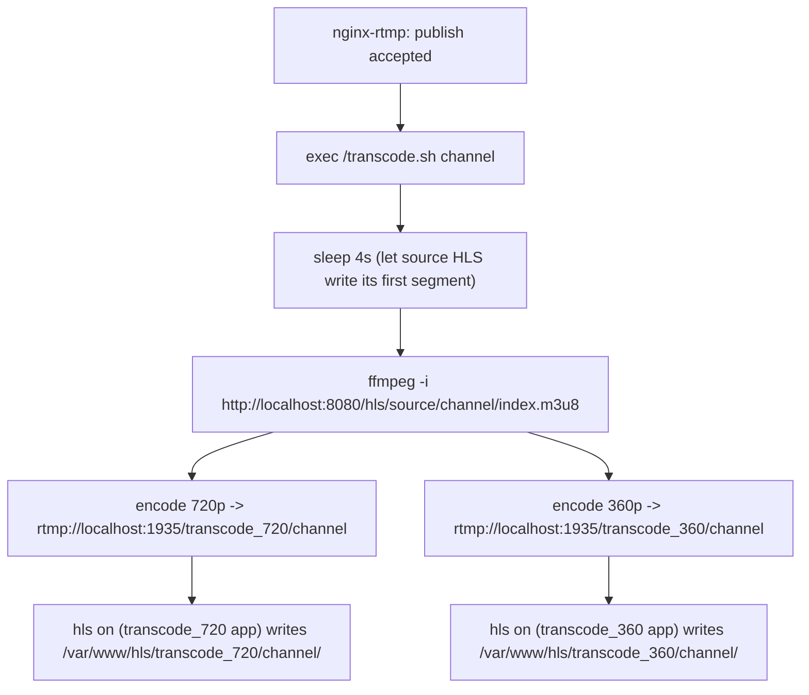
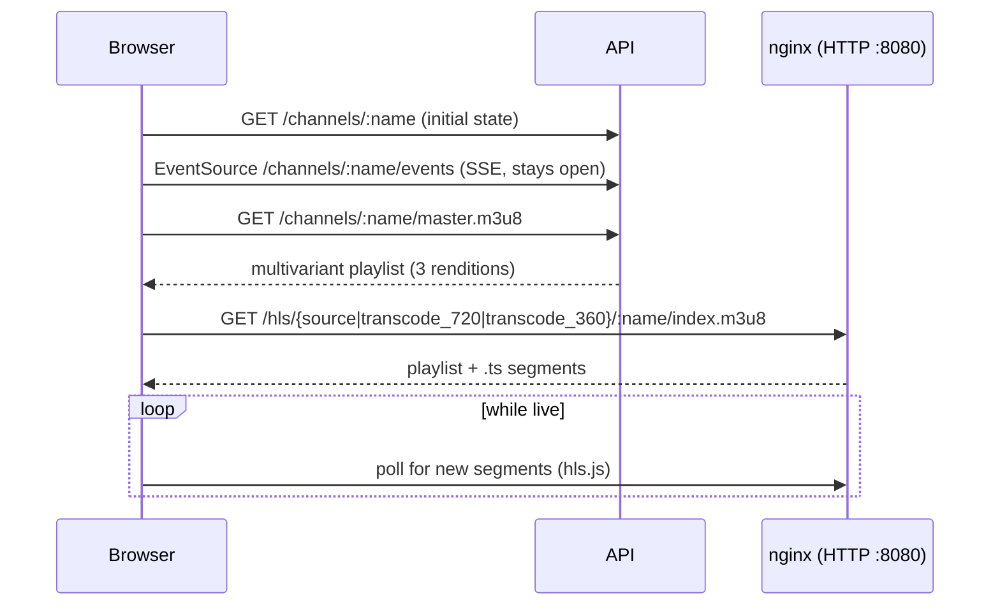
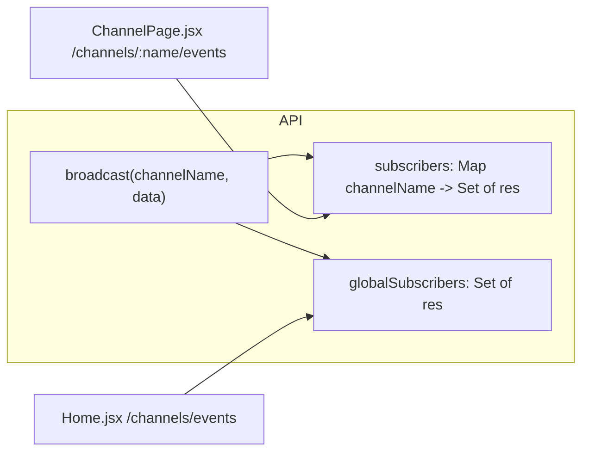

# Live Streaming Platform

A small, live streaming platform built as a learning project — RTMP ingest, HLS delivery with adaptive bitrate, real-time viewer updates, and a full auth/channel system, all running at zero cost on Docker locally (cloud deployment planned separately, if can afford).

## Table of Contents

- [Tech Stack](#tech-stack)
- [Architecture Overview](#architecture-overview)
- [Project Structure](#project-structure)
- [Container Build & Startup Lifecycle](#container-build--startup-lifecycle)
- [The Publish Flow, Step by Step](#the-publish-flow-step-by-step)
- [Adaptive Bitrate Transcoding](#adaptive-bitrate-transcoding)
- [The Viewer Flow](#the-viewer-flow)
- [Real-Time Updates (SSE)](#real-time-updates-sse)
- [Stream End & Cleanup](#stream-end--cleanup)
- [Environment Variables](#environment-variables)
- [Local Development](#local-development)
- [Security Model](#security-model)
- [Known Limitations & Future Work](#known-limitations--future-work)
- [Debugging Notes & Lessons Learned](#debugging-notes--lessons-learned)

---

## Tech Stack

| Layer | Technology |
|---|---|
| RTMP ingest / HLS output | nginx (compiled from source) + [nginx-rtmp-module](https://github.com/arut/nginx-rtmp-module) |
| Transcoding | ffmpeg, spawned by nginx-rtmp's `exec` directive |
| API | Node.js / Express, layered (routes → controllers → services → models) |
| Database | PostgreSQL |
| Real-time updates | Server-Sent Events (SSE), no WebSockets/Socket.io needed |
| Frontend | React + Vite, React Router v8, Tailwind CSS v4, hls.js |
| Auth | JWT in an httpOnly cookie |
| Orchestration | Docker Compose (backend); frontend deployed/run separately |

---

## Architecture Overview



**Three containers on the backend** (a fourth, `frontend`, exists only for local dev convenience and is deliberately *not* part of the same Docker Compose stack that will eventually run on a VM — it's meant to be deployed separately, e.g. to Vercel):

- **`rtmp`** — nginx with the RTMP module compiled in. Handles ingest, validation gating, HLS remuxing, and spawns the transcoding pipeline.
- **`api`** — Express REST API + SSE broadcaster. Owns all business logic: auth, channel CRUD, stream validation, real-time notifications.
- **`postgres`** — never exposed outside the Docker network. Only `api` talks to it.

---

## Project Structure

```
streaming-platform/
├── docker-compose.yml          # rtmp + api + postgres (what runs on the VM)
├── .env                        # secrets (gitignored)
├── .env.example                # safe-to-commit template
│
├── rtmp/
│   ├── Dockerfile               # two-stage build: compile nginx, then slim runtime
│   ├── nginx.conf.template      # config template - vars substituted at container startup
│   ├── entrypoint.sh            # runs first: envsubst, reset-all call, then execs nginx
│   └── transcode.sh             # spawned by nginx-rtmp's `exec` directive per stream
│
├── api/
│   ├── Dockerfile
│   └── src/
│       ├── server.js            # entry point
│       ├── app.js               # Express app, middleware, route mounting
│       ├── config/db.js         # Postgres connection pool
│       ├── routes/              # URL -> handler mapping only
│       ├── controllers/         # HTTP request/response handling
│       ├── services/            # business logic (auth, channel, stream, sse)
│       ├── models/               # the only layer that touches SQL directly
│       ├── middleware/          # auth guard, webhook-secret guard, error handler
│       └── utils/               # jwt signing, stream key generation
│
├── db/
│   └── init.sql                 # schema, auto-run on first Postgres startup
│
└── frontend/                    # separate compose file, deployed independently
    ├── docker-compose.yml
    ├── .env / .env.production
    └── src/
        ├── main.jsx
        ├── lib/api.js            # single fetch wrapper, credentials included
        ├── context/AuthContext.jsx
        ├── components/           # Layout, Navbar, Sidebar, Player, ProtectedRoute
        └── pages/                # Landing, Home, Login, Signup, Dashboard, ChannelPage
```

---

## Container Build & Startup Lifecycle

```mermaid
sequenceDiagram
    participant Docker
    participant Entrypoint as entrypoint.sh
    participant API
    participant Nginx

    Docker->>Entrypoint: CMD ["/entrypoint.sh"] (PID 1)
    Entrypoint->>Entrypoint: envsubst nginx.conf.template -> nginx.conf
    loop retry up to 10x
        Entrypoint->>API: POST /api/stream/reset-all?secret=...
    end
    Note over Entrypoint,API: Clears any stale is_live=true left over<br/>from an ungraceful previous shutdown
    Entrypoint->>Nginx: exec nginx -g 'daemon off;'
    Note over Entrypoint,Nginx: Shell process replaced by nginx<br/>(same PID, new program)
    Nginx->>Nginx: Parse nginx.conf, bind :1935 and :8080
```

**Build time** (`rtmp/Dockerfile`, two stages):
1. **Builder stage** — installs build tools, downloads nginx source, clones `nginx-rtmp-module`, runs `./configure --add-module=... && make install`. The RTMP module is compiled *directly into* the nginx binary, not loaded as a runtime plugin.
2. **Runtime stage** — fresh slim base image, installs only runtime deps (`ffmpeg`, `curl`, `gettext-base`, `procps`), copies the compiled nginx binary plus `nginx.conf.template`, `entrypoint.sh`, `transcode.sh` from the builder stage.

**Why a template instead of a plain `nginx.conf`?** The webhook secret (`INTERNAL_WEBHOOK_SECRET`) lives in `.env`, only available at *container runtime* — but the config file gets baked into the image at *build time*. Templating + `envsubst` at startup keeps one source of truth instead of duplicating the secret in two places.

---

## The Publish Flow, Step by Step



1. **Streamer connects**: `rtmp://host:1935/live/<channel_name>?key=<stream_key>`. Note `channel_name` (public) and `key` (secret) are deliberately separate — more on why in [Security Model](#security-model).
2. **`on_publish` fires** — a *blocking* HTTP callback to the API before nginx-rtmp decides anything. nginx-rtmp auto-forwards `name`, `key`, and standard RTMP connect metadata as form fields in the POST body — no URL variable interpolation needed (this took some trial and error to discover; see [Debugging Notes](#debugging-notes--lessons-learned)).
3. **API validates**: looks up the channel by name, compares the provided key. Any non-2xx response and nginx-rtmp rejects the publish outright.
4. **On success**: `is_live` flips to `true`, a `stream_sessions` row opens, an SSE broadcast fires to any connected viewers/homepage, and nginx-rtmp actually begins accepting the RTMP stream.
5. **`hls on;`** (native remuxing, no re-encoding) starts writing segments for the untouched source stream.
6. **`exec`** spawns `transcode.sh` for the two additional quality renditions.

---

## Adaptive Bitrate Transcoding



Three quality tiers are offered:

| Tier | Cost | How it's produced |
|---|---|---|
| **Source** | Free (no re-encoding) | Native `hls on;` remux of whatever the streamer sends |
| **720p** | Real CPU cost | ffmpeg re-encode, ~2.5 Mbps |
| **360p** | Real CPU cost | ffmpeg re-encode, ~800 Kbps |

Keeping "Source" as a zero-cost tier means only two renditions actually need transcoding, not three.

**Why ffmpeg pulls from HLS instead of RTMP `play`:** the original design had `transcode.sh` pull the source via a direct RTMP `play` connection back to nginx-rtmp. This turned out not to work — confirmed independently with both ffmpeg and VLC, and via nginx-rtmp's own `/stat` page showing the client count never incrementing. Rather than dig further into an obscure, never-otherwise-used code path, the script instead pulls from the *already proven* HLS output — the same URL every viewer already uses. Trade-off: transcoded renditions carry a few extra seconds of latency versus Source.

**Internal-only applications:** `transcode_720` and `transcode_360` are locked down with `allow publish 127.0.0.1; deny publish all;` — only the container's own loopback (i.e., the `exec`'d ffmpeg) can ever publish to them. This prevents anyone from bypassing the real stream-key validation on the `live` application by pushing directly into a transcode app.

**The master playlist** — a small multivariant HLS playlist generated dynamically by the API (`GET /api/channels/:channelName/master.m3u8`), listing all three renditions with bandwidth/resolution info. `hls.js` loads this instead of a single quality's playlist, enabling both automatic adaptive switching and a manual quality dropdown (`hls.currentLevel`).

---

## The Viewer Flow



Playback and channel metadata are fetched from the **API** (port 3000); the actual video **segments** are served directly by **nginx** (port 8080) — two independent request paths, unified only by the master playlist's URLs.

---

## Real-Time Updates (SSE)

Two separate, independently-scoped SSE connections, chosen over WebSockets since the platform only ever needs server→browser push, never the reverse:



- **Per-channel** (`/api/channels/:channelName/events`) — `ChannelPage.jsx` subscribes to just one channel's changes.
- **Site-wide** (`/api/channels/events`) — `Home.jsx` subscribes once and receives every channel's changes, patching its live-channel grid incrementally (add a new card, update, or remove) without ever refetching the whole list.

Both are fed by the same single `broadcast()` call inside `stream.service.js` — no duplicated logic between the two.

**A subtlety worth knowing:** `ChannelPage.jsx` doesn't switch to "offline" the instant an `is_live:false` event arrives. HLS playback is inherently a bit behind real time (segment duration + buffering), and transcoded renditions now carry extra latency on top of that. A grace-period timer (currently 35s) delays the actual UI switch, so already-buffered video finishes playing rather than being cut off mid-stream. If the stream restarts within that window, the timer just cancels — no visible interruption at all.

---

## Stream End & Cleanup

| Scenario | What detects it | What happens |
|---|---|---|
| Clean disconnect (Ctrl+C, "Stop Streaming") | nginx-rtmp's own connection close | `on_publish_done` fires -> API sets `is_live=false`, closes the session, broadcasts SSE |
| Frozen/stalled encoder, no clean close | `drop_idle_publisher 10s;` | Forces a disconnect after 10s idle, then follows the same `on_publish_done` path |
| `rtmp` container itself restarts mid-stream | Nothing *inside* nginx - the process just dies | The **next** container startup's `reset-all` call (see [lifecycle](#container-build--startup-lifecycle)) clears the stale `is_live=true` |

In all cases, the `exec`'d transcoding process is killed automatically by nginx-rtmp once the source publish session ends — tied to the lifecycle of the application where `exec` was declared, not something the script has to detect itself. `hls_cleanup on;` then sweeps stale segment/playlist files for all three renditions once they age past `hls_playlist_length`.

---

## Environment Variables

| Variable | Used by | Purpose |
|---|---|---|
| `POSTGRES_DB` / `POSTGRES_USER` / `POSTGRES_PASSWORD` | postgres, api | Database credentials |
| `JWT_SECRET` | api | Signs the auth cookie's JWT |
| `INTERNAL_WEBHOOK_SECRET` | api, rtmp | Shared secret so only nginx-rtmp can call the stream-validation endpoints |
| `HLS_PUBLIC_BASE` | api | Base URL embedded in the generated master playlist |
| `FRONTEND_ORIGIN` | api | CORS allow-origin for the frontend |
| `VITE_API_BASE` / `VITE_HLS_BASE` / `VITE_RTMP_BASE` | frontend (build-time) | Swappable per environment (local vs. deployed) via `.env` / `.env.production` |

---

## Local Development

```bash
# Backend (rtmp + api + postgres)
docker compose up -d --build

# Frontend, separately
cd frontend
docker compose up -d --build
```

Publish with: `rtmp://localhost:1935/live/<channel_name>?key=<stream_key>` (get both from the Dashboard). View at: `http://localhost:5173/<channel_name>`.

---

## Security Model

- **Passwords**: bcrypt-hashed, never stored/returned in plaintext.
- **Sessions**: JWT in an **httpOnly cookie** (immune to XSS token theft), `sameSite`/`secure` branching on `NODE_ENV` to support the frontend eventually living on a different domain than the API.
- **Postgres**: never exposed outside the Docker network - no host port published.
- **Stream validation endpoints**: protected by a shared secret, checked server-side, so only nginx-rtmp's configured callbacks can trigger them.
- **Ingest key vs. playback identity, decoupled**: streamers publish with `channel_name?key=secret` - nginx-rtmp uses `channel_name` (public, safe) as the actual stream identity/HLS path, while `key` is validated separately and never appears in any public-facing URL or API response. Earlier in development, the stream key doubled as both the publish credential *and* the public HLS filename - meaning any viewer could have extracted it from devtools and hijacked the channel. This was identified and fixed before it shipped.

---

## Known Limitations & Future Work

- **No cloud deployment yet** - deliberately shelved to build the transcoding pipeline first. Oracle Cloud Always Free (Ampere A1) is the target, but real-time transcoding's CPU cost needs to be weighed against the free tier's shrunk allowance (2 OCPU / 12 GB RAM as of mid-2026) before committing.
- **`hls_nested`'s alternative, nginx-rtmp's built-in `hls_variant` directive**, was deliberately avoided in favor of a self-generated master playlist - less "native," but avoids relying on a less-documented nginx-rtmp feature after several other obscure-feature surprises during development.
- **Home/Sidebar vs. ChannelPage real-time parity**: the Sidebar's channel list is still refresh-on-visit only (a deliberate scope decision, not a bug) - Home and ChannelPage both got real-time SSE, Sidebar didn't.
- **Single-VM assumption throughout**: the in-memory SSE subscriber registry (`sse.service.js`) only works correctly for one API process. Horizontal scaling would need a shared pub/sub layer (e.g. Redis) instead.

---

## Debugging Notes & Lessons Learned

A few nginx-rtmp behaviors that don't match common assumptions, discovered the hard way during development - documented here so they aren't re-discovered the same way twice:

- **`resolver` is not a valid directive inside `rtmp { server { } }`** - DNS resolution of Docker service names for `on_publish` callbacks just works via Docker's default embedded DNS, given correct container startup ordering (`depends_on`).
- **`on_publish`'s URL does not support `$arg_xxx` variable interpolation** - confirmed via nginx's own error log showing the variable sent completely unsubstituted. The fix: nginx-rtmp already auto-forwards all publish-time arguments as POST body fields (e.g. `key`) alongside `name` - no URL templating needed at all.
- **`exec`'s substitution only reliably handles bare `$name`, not `${name}` or `$name` immediately followed by an identifier-like suffix** (e.g. `_720`). Confirmed by a `$(date)` shell substitution silently losing its `$` inside an `exec` string - proof nginx-rtmp scans and mangles *any* `$` it doesn't recognize, not just the ones it does. Fix: never concatenate a suffix directly onto `$name`; use separate application names instead.
- **Complex, multi-line, quoted shell commands inside a single `exec` directive are unreliable** - moved the actual transcoding command into a standalone script file (`transcode.sh`), keeping the nginx config's own `exec` line to the simplest possible form (`exec /transcode.sh $name;`).
- **Two `application` blocks cannot share an identical `hls_path`**, even with `hls_nested on;` producing different subfolder names - nginx-rtmp rejects this at config-parse time.
- **Direct RTMP `play` did not work reliably in this setup** for a locally-spawned ffmpeg consumer (confirmed via VLC too, independent of ffmpeg) - pivoted to pulling from the already-proven HLS output instead, rather than continuing to debug an otherwise-unused code path.
- **A process writing to a redirected file doesn't always flush immediately** - `stdbuf -oL -eL` forces line-buffering, useful whenever a background process's log file appears to be empty/stuck despite the process clearly running.
